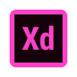

<h1 align="center">Hi 👋, I'm Vikenty</h1>

<h3 align="center"></h3>

- 📝 I’m currently looking for a permanent job.
- 🌱 I’m currently learning **a lot of AI Tools**

<h3 align="left">Contacts:</h3>

- 📫 My e-mail **valve01@bk.ru**
-  My WhatsApp **https://wa.me/+79189602739**
-  My Telegram **https://t.me/+79189602739**

<h3 align="left">Tech stack:</h3>

<table>
  <tr>
    <td valign="middle" align="center"></td>
    <td valign="middle" align="center"></td>
    <td valign="middle" align="center"></td>
    <td valign="middle" align="center"></td>
    <td valign="middle" align="center"></td>
  </tr>
  <tr>
   <td valign="middle" align="center"></td>
    <td valign="middle" align="center"></td>
    <td valign="middle" align="center"></td>
    <td valign="bottom" align="center"></td>
    <td valign="bottom" align="center"></td>
  </tr>
</table>

<!-- 

 -->

<!-- 

 -->

<!-- 
=====================================================
 -->

<!-- 
  
 -->

<!-- 
  
 -->

